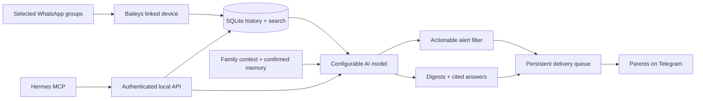

# Family Brief / Семейная сводка

A personal assistant for the flood of school, kindergarten, and activity WhatsApp groups. It reads selected groups, turns Hebrew conversations into Russian digests, and sends actionable updates to both parents on Telegram. Runs as **one Docker container**, with SQLite and the WhatsApp session in a persistent volume.

This is a working first version, with automated integration tests. Connecting your real accounts and assessing your chosen model against real school messages are still required.

## What you can do

- Request `/summary 24h`, `/summary 7d`, or `/summary 48h Название группы`.
- Receive a scheduled Russian digest, initially at **20:00 in Asia/Hebron**. Add multiple schedules if you prefer a morning and evening digest.
- Receive separate alerts for actionable cancellations, pickup changes, safety notices, and nearby deadlines. Routine conversation goes into summaries. Normal notifications wait through quiet hours, initially 22:00–07:00; urgent notices and replies to your commands bypass them.
- Ask `/ask Когда экскурсия и что нужно взять?`, or type a question in Russian. The assistant creates Hebrew search terms, retrieves original messages, and answers with sources.
- Keep parent-confirmed family facts with `/remember`, review AI suggestions with `/candidates`, and inspect saved discussion topics with `/topics`.
- Read the original Hebrew source with `/source ID`. Every significant finding has source IDs, and alerts include original excerpts.
- Let **Nous Research Hermes Agent** use the same history, memory, and summaries through MCP.

## How it works



The WhatsApp client only ingests the group IDs you have selected. The AI receives the relevant text, timestamps, group context, and confirmed family facts. It has no tools and cannot send messages itself. The application validates its output and source IDs before using it. Model-produced memory stays unconfirmed until you save it explicitly.

### It cannot write to WhatsApp

The linked account is read-only by construction, not by convention. Baileys exposes 170 methods on its socket, 77 of which change something on WhatsApp's side — sending messages, read receipts, presence, group administration, profile edits, blocking. The socket is wrapped in an allow-list proxy that permits exactly seven things:

| Allowed | Why |
|---|---|
| `ev` | receive events |
| `ws` | connection state only |
| `authState` | is this device registered |
| `end` | close the connection locally |
| `requestPairingCode` | link this device |
| `logout` | unlink this device, on your explicit request |
| `groupFetchAllParticipating` | read group names |
| `resyncAppState` | fetch your own chat settings: archived, last activity |
| `fetchMessageHistory` | ask for older messages in a group you just followed |

`resyncAppState` deserves a note: it is framed as an `iq type="set"` because that is how WhatsApp's app-state protocol *requests* state, and it changes nothing on the account. Baileys already calls it on every connect; allowing it only lets the app ask for a fresh snapshot when archive state is missing.

`fetchMessageHistory` is the one genuine send, and it is deliberate. WhatsApp only ships chat history when a device is linked, so a group you follow later would start from empty. It relays a protocol message to your **own** account (`category: 'peer'`) asking for older messages in that one chat: it is never delivered to a conversation and no other participant can see it. It fires automatically, in the background, on the group's first incoming message — which is the earliest point there is a message to page backwards from.

Everything else throws `WhatsAppWriteBlocked` when called, and never reaches WhatsApp. A deny-list would rot as Baileys grows; this fails closed, so a future change cannot quietly acquire the ability to write. The guard also refuses assignment and deletion, so it cannot be patched around at runtime. `markOnlineOnConnect` is off, so using this app never makes the account appear online.

Two honest limits. Baileys still performs the protocol-level acknowledgements any linked device must send to stay connected — those are inseparable from being a WhatsApp Web client. And *read receipts* (blue ticks) are only ever sent by `readMessages`, which is blocked, so reading a group through this app does not mark it read for anyone.

## Deploying to a server

The image is public and carries nothing private: no `.env`, no `config.json`, no database. Everything secret stays in your environment file and the data volume on the host.

```sh
# on the VPS
mkdir family-brief && cd family-brief
curl -O https://raw.githubusercontent.com/OWNER/family-brief/main/compose.prod.yaml
curl -o .env https://raw.githubusercontent.com/OWNER/family-brief/main/.env.example
# fill in API_TOKEN, LLM_*, TELEGRAM_* — then:
docker compose -f compose.prod.yaml up -d
```

No configuration file is needed. Children, groups and notes are managed from Telegram and stored in the database, so a fresh deployment needs only the environment and a volume; `compose.prod.yaml` deliberately leaves `CONFIG_PATH` unset. A `config.json` is still read if you mount one, which is useful for seeding per-group `context` and `children`.

The container runs as a non-root user on a read-only root filesystem with all capabilities dropped, and publishes its port on loopback only. Point your existing reverse proxy at `127.0.0.1:8080` if you want the API reachable; nothing outside the VPS needs to reach it for Telegram or WhatsApp to work, since both are outbound connections.

`.github/workflows/publish.yml` builds and pushes to GHCR on every push to `main` and on `v*` tags, for `linux/amd64` and `linux/arm64`. It runs `npm run check` first, so a red suite never ships. **GHCR packages start private** — make it public once in the repo's package settings if you want the image pullable without a login.

Upgrades are `docker compose -f compose.prod.yaml pull && docker compose -f compose.prod.yaml up -d`. The volume carries the WhatsApp session, so it does not need re-linking; database migrations run automatically on start.

## Setup

You need Docker Compose, a WhatsApp account that belongs to the relevant groups, a dedicated Telegram bot, and a model with Hebrew/Russian support through an OpenAI-compatible Chat Completions endpoint. A local model endpoint also works if it supports the same contract. The configured model identifier is deliberately left blank.

### 1. Create private configuration

With Node.js 22.13 or newer:

```sh
npm ci
npm run cli -- init
```

This generates `.env` with a random API token and copies `config.example.json` to `config.json`. Existing files are preserved. Both personal files are ignored by Git.

Without Node installed on the VPS, build the image and initialize a host directory using Docker:

```sh
docker build -t family-brief:local .
docker run --rm --user "$(id -u):$(id -g)" \
  -v "$PWD:/setup" -w /setup family-brief:local \
  node /app/dist/cli.js init
```

The repository's example files must be present in the current directory for this command.

Edit `.env`:

```dotenv
LLM_BASE_URL=https://api.openai.com/v1
LLM_API_KEY=your-provider-key
LLM_MODEL=your-exact-model-id
WHATSAPP_ENABLED=true
```

`LLM_BASE_URL` should end at the API version prefix, such as `/v1`; the application adds `/chat/completions`. `LLM_JSON_MODE=false` omits `response_format` for providers that don't implement it, but the returned JSON still must pass validation. The model is called for periodic analysis, requested/scheduled digests, and questions. Broad historical summaries make one request per text chunk, so start with a short period and check quality and usage.

### 2. Set up Telegram for both parents

1. Create a dedicated bot with [@BotFather](https://t.me/BotFather) and put its token in `TELEGRAM_BOT_TOKEN`.
2. Each parent opens the bot and sends `/start`. For a shared private family group, add the bot to that group and send a command there too.
3. While the service is stopped, run `npm run cli -- telegram-ids`. With Docker, use:

   ```sh
   docker run --rm --env-file .env family-brief:local node dist/cli.js telegram-ids
   ```

4. Set `TELEGRAM_USER_IDS` to both parents' numeric user IDs. Set `TELEGRAM_CHAT_IDS` to both private chat IDs, or the single private family group ID. Comma-separate multiple IDs.

```dotenv
TELEGRAM_USER_IDS=123456789,987654321
TELEGRAM_CHAT_IDS=123456789,987654321
```

These are example IDs. Both a permitted **user** and a permitted **chat** are required for commands. Alerts are delivered to every configured chat. The helper displays IDs and names, not message text or the bot token. Use a dedicated bot because the service uses Telegram long polling; another poller or an existing webhook would conflict with it.

### 3. Pair WhatsApp and choose groups, from Telegram

Start the service, then do the rest in the chat with your bot. Nothing here needs a terminal, a file edit, or a restart.

```sh
docker compose up -d --build
```

Send `/link` with your phone number in international format. The bot replies with an eight-character code:

```
/link +972501234567
→ Код: ABCD-1234
```

On your phone: **WhatsApp → Settings → Linked devices → Link a device → Link with phone number instead**, and type the code. It is valid for about a minute; repeat `/link` for a new one. If you would rather scan, `/link qr` sends the QR as a picture to the same chat.

Everything else happens in a **private chat with your bot**. Open a direct chat with it, send `/start`, and use the buttons — there is no syntax to learn.

The two kinds of chat do different jobs. Your direct chat is where setup and management live: linking WhatsApp, children, groups, notes. The family group is where the bot *delivers* — scheduled digests and urgent alerts — and where either of you can ask it something (`/summary 24h`, `/ask вопрос`, or a plain question). Configuration commands are refused in the group and point you to the direct chat, so a settings menu can never surface in front of everyone.

Your direct chat needs no extra configuration: a private chat's ID is your own user ID, so anyone in `TELEGRAM_USER_IDS` can reach the bot directly. `TELEGRAM_CHAT_IDS` stays the list of places digests and alerts are *sent*.

```
Семейный помощник
Детей: 0 · Групп: 0

[ 🧒 Дети ]          [ 💬 Группы ]
[ 📋 Сводка за сутки ] [ ⚙️ Состояние ]
```

**Link WhatsApp.** *Состояние → Подключить WhatsApp → По номеру телефона*, then send your number. The bot replies with an eight-character code; in WhatsApp go to **Settings → Linked devices → Link a device → Link with phone number instead** and type it. *Показать QR-код* sends a QR picture instead if you prefer to scan.

**Add a child.** *Дети → ➕ Добавить ребёнка*, then send the name. Tap the child to add a description — class, teacher, activities — which makes the digests noticeably better.

**Attach groups.** *Группы* lists what WhatsApp reports, re-read each time you open it. Tap a group and the bot asks whose messages these are; tap the child and it starts analysing. Tapping a group you already follow offers a comment, a different child, or turning it off.

**Tell it about a group.** Tap *📝 Комментарий* and reply in plain words — "важное пишет учительница Рина, физкультура по вторникам". The note is yours, so it is trusted and goes to the model with every analysis of that group. The bot also shows what it understood from the note and offers *✅ Сохранить факты*; those are the *model's* reading of your words, so they stay out of the prompt until you tap. This is the same rule that governs facts picked out of ordinary messages, which you review with `/candidates`.

Typing still works for everything — `/kids`, `/watch 2 Даниэль`, `/note 2 текст` — and any plain sentence is treated as a question. The buttons exist so you never need to know that.

Selected groups live in the database, so `config.json` is only a seed plus optional per-group detail. Adding `children` and `context` there for a group ID measurably improves digests, and those values survive re-selecting the group from chat. No message history is stored for groups you have not selected. This example uses invented names and a placeholder group ID:

```json
{
  "timezone": "Asia/Hebron",
  "language": "Russian",
  "family": [
    { "name": "Даниэль / דניאל", "context": "Класс ב2. Учительница — Рина / רינה." }
  ],
  "groups": [
    {
      "id": "REPLACE_WITH_REAL_GROUP_ID@g.us",
      "name": "Школа — класс Даниэля",
      "children": ["Даниэль / דניאל"],
      "context": "Группа родителей класса ב2. Сообщения учителя часто пересылает представитель родителей.",
      "alerts": true
    }
  ],
  "digests": [{ "name": "evening", "cron": "0 20 * * *" }],
  "quietHours": { "start": 22, "end": 7 },
  "retentionDays": 0
}
```

Other settings receive their defaults. Keep the custom Russian `alertRules` from the example file or write your own. Names in both Hebrew and Russian improve the context available to the model. Restart after changing configuration or environment variables:

```sh
docker compose up -d --force-recreate
docker compose exec -T family-brief node dist/cli.js status
```

The session persists through restarts. New selected-group messages will be retained. WhatsApp may supply some earlier history during sync, but full history is **not guaranteed**, and initial history received before a group was selected is discarded. Use exports to fill gaps.

### 4. Try it in Russian

```text
/remember Даниэль.класс = Даниэль учится в ב2, учительница Рина
/summary 24h
/ask Что нужно принести на экскурсию?
/search טיול
/memory
/candidates
/topics
/status
```

The bot also accepts ordinary Russian questions. Commands stay short and Latin; responses are Russian. `/remember key = value` saves a fact or confirms a suggested fact under its exact key. `/forget key` removes it. Editable family profiles and group assignments live in `config.json`.

## Historical imports

Export a WhatsApp chat **without media** as a `.txt` file. The parser accepts common iOS bracketed and Android dashed numeric date formats, multiline text, Hebrew direction marks, and 12/24-hour times. It defaults to day/month/year and the configured timezone. Pass `--month-first` for US dates. Unsupported formats fail explicitly.

With a local running service:

```sh
npm run cli -- import /path/to/chat.txt 'REAL_GROUP_ID@g.us'
```

With Docker, copy the file into the container's temporary directory:

```sh
docker compose cp /path/to/chat.txt family-brief:/tmp/chat.txt
docker compose exec -T family-brief node dist/cli.js import /tmp/chat.txt 'REAL_GROUP_ID@g.us'
```

JSON imports are also supported as an array of `{ "chatId", "externalId", "sender", "timestamp", "text" }`, with timestamps in **Unix milliseconds**. `/import` and the CLI always treat imports as historical: they are searchable and included in digests, but do not trigger a burst of old alerts.

Identical export messages use stable IDs so re-importing the same export is idempotent. Export IDs differ from live WhatsApp IDs; overlapping an export with live capture can leave duplicate text. Two identical exported messages from the same sender at the exact same timestamp are merged.

## Hermes Agent

Family Brief supplies a standard **stdio MCP server**. Hermes launches the adapter; it calls the running application's authenticated API. It exposes eight tools for status, groups, keyword search, questions, summaries, memory, topics, and source lookup. There are no tools for sending messages or editing family data.

When Hermes and Docker run on the same VPS, add this to `~/.hermes/config.yaml`, replacing the project path:

```yaml
mcp_servers:
  family-brief:
    command: docker
    timeout: 600
    args:
      - compose
      - --project-directory
      - /opt/family-brief
      - exec
      - -T
      - family-brief
      - node
      - dist/mcp.js
```

Hermes must be able to run Docker under its OS account. The MCP adapter inherits the container's API token, so you don't need to copy it into Hermes configuration. Reload MCP or restart Hermes, then ask:

> Посмотри в семейных чатах, что нам нужно подготовить детям на завтра. Приведи источники.

If Hermes runs elsewhere, use an SSH connection to the VPS to launch that same command, or run the adapter locally against an SSH-tunneled API. The project does not expose a public HTTP MCP endpoint. The Hermes [MCP guide](https://hermes-agent.nousresearch.com/docs/user-guide/features/mcp/) explains stdio configuration and tool filtering.

## API and development

The API binds to localhost by default; Compose publishes only `127.0.0.1:8080`. Every route except `/healthz` requires `Authorization: Bearer API_TOKEN`. For remote access, use an SSH tunnel or private network with appropriate transport protection.

| Endpoint | Purpose |
| --- | --- |
| `GET /healthz` | Liveness only; no private data |
| `GET /status` | Connectivity, pending work, failures, schedule state |
| `GET /groups` | Selected and discovered groups |
| `GET /whatsapp/pairing` | Current short-lived pairing QR payload |
| `POST /summary` | `{ "period": "24h", "group": "optional name" }`, or explicit ISO `from`/`to` |
| `POST /ask` | `{ "question": "Когда экскурсия?" }` |
| `GET /search?q=…` | Keyword search, optional `limit` up to 100 |
| `GET /sources/:id` | Original source message |
| `GET /memory` | Confirmed and proposed facts |
| `PUT /memory` | Confirm `{ "key": "…", "value": "…" }` |
| `DELETE /memory/:key` | Remove a fact |
| `GET /topics?q=…` | Saved discussion snapshots |
| `POST /import` | Import up to 1,000 historical messages per request |

```sh
npm ci
npm run check
npm run dev
```

Tests use fake model and Telegram transports, an in-memory or temporary SQLite database, and a real MCP stdio client/server handshake. They make no live model calls and send no Telegram messages. The container can be built with `docker build -t family-brief:local .`.

After building, `node scripts/smoke-docker.mjs` verifies an isolated container's authenticated API, Hebrew import/search, non-root execution, read-only filesystem, CLI, and persistence through restart. It creates and removes only its own temporary container and volume.

The implementation uses the [Baileys session and socket APIs](https://baileys.wiki/authentication/session-management), [Telegram Bot API](https://core.telegram.org/bots/api), [Chat Completions API contract](https://developers.openai.com/api/reference/typescript/resources/chat/subresources/completions/methods/create), and [official MCP SDK](https://github.com/modelcontextprotocol/typescript-sdk).

## Persistence and operations

- **One running replica per volume.** The scheduler and Telegram poller are designed for one process. SQLite holds history, full-text search, facts, discussion snapshots, auth credentials/keys, scheduling boundaries, update offsets, and a durable delivery queue.
- **Retries.** Model failures leave live messages pending. Failed digests retain their original start boundary and retry in five minutes; a missed schedule produces one catch-up digest on return. Telegram delivery retries independently for each recipient, respects `retry_after`, and preserves failed multipart ordering. An ambiguous network failure after Telegram accepted a message can still produce a duplicate: delivery is at least once, not exactly once.
- **Deduplication.** Ingestion is idempotent by group/message ID. Alerts use model event identity/date plus normalized source text and title. Semantically similar forwards can still escape deduplication; tune the alert rules against real chats.
- **Storage.** `retentionDays: 0` keeps history indefinitely. A positive value prunes older source messages, snapshots, sent deliveries, old alerts, and unconfirmed facts. Confirmed facts and unsent deliveries remain. Existing Telegram messages and your backups are not affected. Database pages and backups are not securely erased by retention cleanup.
- **Backup.** Stop the service before copying the volume so SQLite and its WAL are consistent. Keep the whole volume, which also contains the linked-device session. For example:

  ```sh
  docker compose stop
  docker compose cp family-brief:/app/data ./backup-data
  docker compose start
  ```

  Keep that backup private and encrypted. Restore only into a stopped service, and preserve ownership for the container's `node` user (UID 1000). Do not delete the Docker volume during routine updates.
- **Connection problems.** `/status` and the CLI report `scan_qr`, `connected`, `reconnecting`, or `needs_attention:<code>`. A logged-out/replaced/bad session needs attention rather than endless reconnecting. Re-link by stopping the service and deliberately clearing only the `wa_auth` table after backing up. Normal network disconnections reconnect with backoff. Use `/status` to inspect processing/delivery failures as well; container health is only liveness.

## Current boundaries

- **One linked WhatsApp account.** It must belong to the groups you want to follow. Groups available only on the other parent's account need an additional account integration in a future version.
- **Unofficial access.** Baileys is an unofficial WhatsApp client; account restrictions and upstream compatibility changes are possible. The application does not send WhatsApp messages. The pinned Baileys version is a release candidate and still needs a live pairing check with your account.
- **Text first.** Text, captions, document filenames, and poll questions are ingested. Images, documents, voice notes, video, and poll vote results are not interpreted. Unread media are labelled; OCR and transcription remain future work.
- **AI limitations.** Source IDs are checked for existence; that cannot prove a model interpreted the evidence correctly. Confidence is the model's own estimate. A digest can contain mistakes, and an important event can be missed. Review real outputs before relying on alerts. Very long discussions are processed in chronological chunks; a correction outside a chunk's context may not be reconciled with an earlier finding.
- **Search.** SQLite provides keyword retrieval with AI Hebrew/Russian query expansion, not embedding-based semantic search. Answers use a bounded subset of matches and may miss differently worded or later updates. Saved topics are dated snapshots, not guaranteed current facts. A later edit updates the stored source; already-generated summaries and delivered alerts are not retroactively rewritten.
- **Data flow.** Selected messages and confirmed family context go to your configured model provider. Digests, alerts, and source excerpts go to the Telegram chats you explicitly configure. Local data are not encrypted by this app; use your VPS/storage security and protect `.env`, the volume, backups, and API token.

Useful next additions after validating the first week of real messages: voice-note transcription, image/PDF reading, explicit reminder/action tracking, and a second WhatsApp account.
